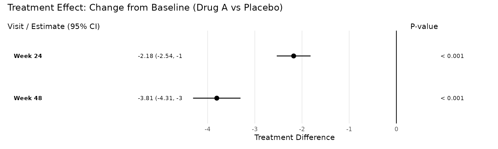
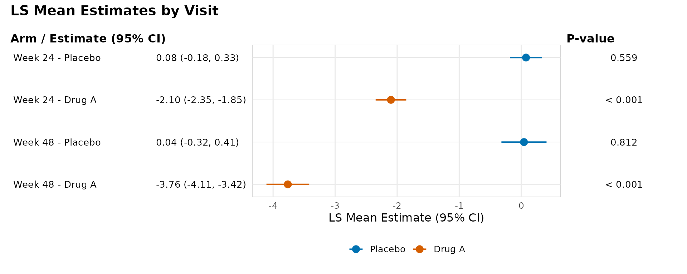
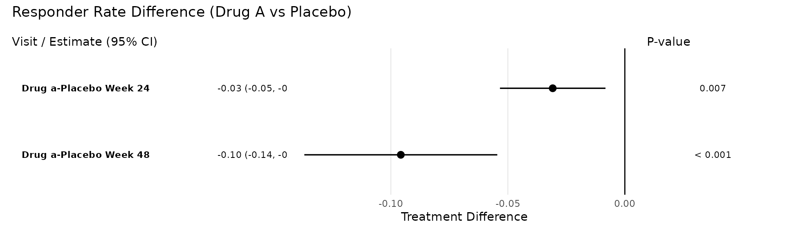

# From rbmi Analysis to Regulatory Tables

## Introduction

Clinical trial analyses that use reference-based multiple imputation
typically involve several steps: fitting an imputation model, generating
imputed datasets, applying an analysis to each dataset, and pooling
results using Rubin’s rules. The
[rbmi](https://cran.r-project.org/package=rbmi) package implements this
pipeline with its
[`draws()`](https://openpharma.github.io/rbmi/latest-tag/reference/draws.html),
[`impute()`](https://openpharma.github.io/rbmi/latest-tag/reference/impute.html),
[`analyse()`](https://openpharma.github.io/rbmi/latest-tag/reference/analyse.html),
and
[`pool()`](https://openpharma.github.io/rbmi/latest-tag/reference/pool.html)
functions. However, turning the pooled results into publication-ready
outputs – formatted tables and forest plots suitable for regulatory
submissions – requires additional work.

The **rbmiUtils** package bridges this gap. It provides utilities that
sit on top of rbmi, transforming pooled analysis objects into tidy data
frames, regulatory-style efficacy tables, and three-panel forest plots.
It also includes data preparation helpers that catch common issues
before the computationally expensive imputation step.

In this vignette, you will walk through the complete pipeline from raw
clinical trial data to two publication-ready outputs: an efficacy
summary table and a forest plot. By the end, you will have seen every
major step in a typical rbmi + rbmiUtils workflow. For a more focused
reference on the analysis functions, see the [analyse2
vignette](https://openpharma.github.io/rbmiUtils/articles/analyse2.md).
For detailed guidance on data preparation, see the [data preparation
vignette](https://openpharma.github.io/rbmiUtils/articles/data-preparation.md).

## Setup and Data

We begin by loading the packages we need. The core pipeline requires
**rbmi** and **rbmiUtils**, with **dplyr** for data manipulation. The
reporting outputs use **gt** (for tables) and **ggplot2** +
**patchwork** (for plots), which are optional dependencies.

``` r
library(rbmi)
library(rbmiUtils)
library(dplyr)
```

The `ADEFF` dataset bundled with rbmiUtils is a simulated ADaM-style
efficacy dataset from a two-arm clinical trial. It contains continuous
change-from-baseline outcomes (`CHG`) measured at two visits (Week 24
and Week 48), with realistic missing data patterns across 500 subjects.

``` r
data("ADEFF", package = "rbmiUtils")
```

``` r
str(ADEFF)
#> tibble [1,000 × 10] (S3: tbl_df/tbl/data.frame)
#>  $ USUBJID: chr [1:1000] "ID001" "ID001" "ID002" "ID002" ...
#>   ..- attr(*, "label")= chr "Unique patient identifier"
#>  $ STRATA : chr [1:1000] "A" "A" "A" "A" ...
#>   ..- attr(*, "label")= chr "Stratification at randomisation"
#>  $ REGION : chr [1:1000] "North America" "North America" "Asia" "Asia" ...
#>   ..- attr(*, "label")= chr "Stratification by region"
#>  $ REGIONC: num [1:1000] 1 1 4 4 2 2 3 3 2 2 ...
#>   ..- attr(*, "label")= chr "Stratification by region, numeric code"
#>  $ TRT01P : chr [1:1000] "Drug A" "Drug A" "Drug A" "Drug A" ...
#>   ..- attr(*, "label")= chr "Planned treatment"
#>  $ BASE   : num [1:1000] 16 16 10 10 12 12 11 11 9 9 ...
#>   ..- attr(*, "label")= chr "Baseline value of primary outcome variable"
#>  $ AVISIT : chr [1:1000] "Week 24" "Week 48" "Week 24" "Week 48" ...
#>   ..- attr(*, "label")= chr "Visit number"
#>  $ AVAL   : num [1:1000] 12 13 7 5 9 10 9 13 4 0 ...
#>   ..- attr(*, "label")= chr "Primary outcome variable"
#>  $ PARAM  : chr [1:1000] "ESSDAI score" "ESSDAI score" "ESSDAI score" "ESSDAI score" ...
#>   ..- attr(*, "label")= chr "Analysis parameter name"
#>  $ CHG    : num [1:1000] -4 -3 -3 -5 -3 -2 -2 2 -5 -9 ...
#>   ..- attr(*, "label")= chr "Change from baseline"
```

Before entering the rbmi pipeline, we convert the key grouping columns
to factors. Factor levels control the ordering of treatment arms and
visits throughout the analysis, so it is important to set them
explicitly.

``` r
ADEFF <- ADEFF |>
  mutate(
    TRT = factor(TRT01P, levels = c("Placebo", "Drug A")),
    USUBJID = factor(USUBJID),
    AVISIT = factor(AVISIT, levels = c("Week 24", "Week 48"))
  )
```

## Data Preparation

Before running the imputation model, it is worth investing a moment to
validate the data and understand the missing data patterns. These checks
can save considerable time by catching issues before the computationally
intensive
[`draws()`](https://openpharma.github.io/rbmi/latest-tag/reference/draws.html)
step.

### Validation

The
[`validate_data()`](https://openpharma.github.io/rbmiUtils/reference/validate_data.md)
function performs a comprehensive set of pre-flight checks: it verifies
that all required columns exist, that factors are properly typed, that
the outcome is numeric, that covariates have no missing values, and that
there are no duplicate subject-visit rows.

``` r
vars <- set_vars(
  subjid = "USUBJID",
  visit = "AVISIT",
  group = "TRT",
  outcome = "CHG",
  covariates = c("BASE", "STRATA", "REGION")
)
```

``` r
validate_data(ADEFF, vars)
```

A successful validation returns `TRUE` silently. If issues are found,
all problems are reported together in a single error message so you can
fix them in one pass.

### Missingness Summary

The
[`summarise_missingness()`](https://openpharma.github.io/rbmiUtils/reference/summarise_missingness.md)
function characterises the missing data patterns in your dataset,
classifying each subject as complete, monotone (dropout), or
intermittent.

``` r
miss <- summarise_missingness(ADEFF, vars)
print(miss$summary)
#> # A tibble: 2 × 5
#>   group   n_subjects n_complete n_monotone n_intermittent
#>   <chr>        <int>      <int>      <int>          <int>
#> 1 Drug A         261        239         11             11
#> 2 Placebo        239        217         16              6
```

This summary helps you decide on an appropriate imputation strategy. For
datasets that require intercurrent event (ICE) handling, rbmiUtils also
provides
[`prepare_data_ice()`](https://openpharma.github.io/rbmiUtils/reference/prepare_data_ice.md)
to build the `data_ice` data frame from flag columns – see the [data
preparation
vignette](https://openpharma.github.io/rbmiUtils/articles/data-preparation.md)
for details.

## rbmi Analysis Pipeline

With the data validated, we now run the core rbmi pipeline. This
consists of four steps: specifying the imputation method, fitting the
imputation model, generating imputed datasets, and analysing each one.

### Specify the Imputation Method

The
[`method_bayes()`](https://openpharma.github.io/rbmi/latest-tag/reference/method.html)
function configures Bayesian multiple imputation using MCMC sampling.
Here we use a small number of samples and a short warmup period to keep
the vignette build time manageable. In a real analysis, you would
typically use more samples (e.g., `n_samples = 500` or more) for better
precision. For details on the statistical methodology, see the [rbmi
quickstart
vignette](https://cran.r-project.org/web/packages/rbmi/vignettes/quickstart.html).

``` r
set.seed(1974)

method <- method_bayes(
  n_samples = 100,
  control = control_bayes(warmup = 200, thin = 2)
)
```

### Fit the Imputation Model

The
[`draws()`](https://openpharma.github.io/rbmi/latest-tag/reference/draws.html)
function fits the Bayesian imputation model. This is the most
computationally intensive step in the pipeline. We pass the dataset with
only the columns needed for the model.

``` r
dat <- ADEFF |>
  select(USUBJID, STRATA, REGION, TRT, BASE, CHG, AVISIT)

draws_obj <- draws(data = dat, vars = vars, method = method)
#> Running /opt/R/4.5.2/lib/R/bin/R CMD SHLIB foo.c
#> using C compiler: ‘gcc (Ubuntu 13.3.0-6ubuntu2~24.04) 13.3.0’
#> gcc -std=gnu2x -I"/opt/R/4.5.2/lib/R/include" -DNDEBUG   -I"/home/runner/work/_temp/Library/Rcpp/include/"  -I"/home/runner/work/_temp/Library/RcppEigen/include/"  -I"/home/runner/work/_temp/Library/RcppEigen/include/unsupported"  -I"/home/runner/work/_temp/Library/BH/include" -I"/home/runner/work/_temp/Library/StanHeaders/include/src/"  -I"/home/runner/work/_temp/Library/StanHeaders/include/"  -I"/home/runner/work/_temp/Library/RcppParallel/include/"  -I"/home/runner/work/_temp/Library/rstan/include" -DEIGEN_NO_DEBUG  -DBOOST_DISABLE_ASSERTS  -DBOOST_PENDING_INTEGER_LOG2_HPP  -DSTAN_THREADS  -DUSE_STANC3 -DSTRICT_R_HEADERS  -DBOOST_PHOENIX_NO_VARIADIC_EXPRESSION  -D_HAS_AUTO_PTR_ETC=0  -include '/home/runner/work/_temp/Library/StanHeaders/include/stan/math/prim/fun/Eigen.hpp'  -D_REENTRANT -DRCPP_PARALLEL_USE_TBB=1   -I/usr/local/include    -fpic  -g -O2  -c foo.c -o foo.o
#> In file included from /home/runner/work/_temp/Library/RcppEigen/include/Eigen/Core:19,
#>                  from /home/runner/work/_temp/Library/RcppEigen/include/Eigen/Dense:1,
#>                  from /home/runner/work/_temp/Library/StanHeaders/include/stan/math/prim/fun/Eigen.hpp:22,
#>                  from <command-line>:
#> /home/runner/work/_temp/Library/RcppEigen/include/Eigen/src/Core/util/Macros.h:679:10: fatal error: cmath: No such file or directory
#>   679 | #include <cmath>
#>       |          ^~~~~~~
#> compilation terminated.
#> make: *** [/opt/R/4.5.2/lib/R/etc/Makeconf:202: foo.o] Error 1
#> 
#> SAMPLING FOR MODEL 'rbmi_MMRM_us_default' NOW (CHAIN 1).
#> Chain 1: 
#> Chain 1: Gradient evaluation took 0.00045 seconds
#> Chain 1: 1000 transitions using 10 leapfrog steps per transition would take 4.5 seconds.
#> Chain 1: Adjust your expectations accordingly!
#> Chain 1: 
#> Chain 1: 
#> Chain 1: Iteration:   1 / 400 [  0%]  (Warmup)
#> Chain 1: Iteration:  40 / 400 [ 10%]  (Warmup)
#> Chain 1: Iteration:  80 / 400 [ 20%]  (Warmup)
#> Chain 1: Iteration: 120 / 400 [ 30%]  (Warmup)
#> Chain 1: Iteration: 160 / 400 [ 40%]  (Warmup)
#> Chain 1: Iteration: 200 / 400 [ 50%]  (Warmup)
#> Chain 1: Iteration: 201 / 400 [ 50%]  (Sampling)
#> Chain 1: Iteration: 240 / 400 [ 60%]  (Sampling)
#> Chain 1: Iteration: 280 / 400 [ 70%]  (Sampling)
#> Chain 1: Iteration: 320 / 400 [ 80%]  (Sampling)
#> Chain 1: Iteration: 360 / 400 [ 90%]  (Sampling)
#> Chain 1: Iteration: 400 / 400 [100%]  (Sampling)
#> Chain 1: 
#> Chain 1:  Elapsed Time: 0.66 seconds (Warm-up)
#> Chain 1:                0.543 seconds (Sampling)
#> Chain 1:                1.203 seconds (Total)
#> Chain 1:
```

### Generate Imputed Datasets

The
[`impute()`](https://openpharma.github.io/rbmi/latest-tag/reference/impute.html)
function generates complete datasets under the specified reference-based
assumption. Here we use a jump-to-reference approach where both arms are
imputed under the reference (Placebo) distribution.

``` r
impute_obj <- impute(
  draws_obj,
  references = c("Placebo" = "Placebo", "Drug A" = "Placebo")
)
```

### Analyse Each Imputed Dataset

Rather than calling
[`rbmi::analyse()`](https://openpharma.github.io/rbmi/latest-tag/reference/analyse.html)
directly, rbmiUtils provides
[`analyse_mi_data()`](https://openpharma.github.io/rbmiUtils/reference/analyse_mi_data.md),
which wraps the analyse step to work with the stacked imputed data
format. It applies an analysis function – here, the built-in `ancova`
function – to each imputed dataset and stores the results for pooling.

First, we extract the imputed data into a stacked data frame using
[`get_imputed_data()`](https://openpharma.github.io/rbmiUtils/reference/get_imputed_data.md):

``` r
ADMI <- get_imputed_data(impute_obj)
```

Then we analyse:

``` r
ana_obj <- analyse_mi_data(
  data = ADMI,
  vars = vars,
  method = method,
  fun = ancova
)
```

### Pool Results

Finally,
[`pool()`](https://openpharma.github.io/rbmi/latest-tag/reference/pool.html)
combines the per-imputation results using [Rubin’s
rules](https://cran.r-project.org/package=rbmi) to produce a single set
of estimates, standard errors, confidence intervals, and p-values.

``` r
pool_obj <- pool(ana_obj)
print(pool_obj)
#> 
#> ── Pool Object ─────────────────────────────────────────────────────────────────
#> 6 parameters across 2 visits
#> Method: rubin
#> N imputations: 100
#> Confidence: 95%
#> ────────────────────────────────────────────────────────────────────────────────
#>        parameter   visit   est   lci   uci    pval
#>      trt_Week 24 Week 24 -2.18 -2.54 -1.82 < 0.001
#>  lsm_ref_Week 24 Week 24  0.08 -0.18  0.33   0.559
#>  lsm_alt_Week 24 Week 24 -2.10 -2.35 -1.85 < 0.001
#>      trt_Week 48 Week 48 -3.81 -4.31 -3.30 < 0.001
#>  lsm_ref_Week 48 Week 48  0.04 -0.32  0.41   0.812
#>  lsm_alt_Week 48 Week 48 -3.76 -4.11 -3.42 < 0.001
```

## Tidying Results

The pool object contains all the information we need, but its structure
is not immediately convenient for reporting. The
[`tidy_pool_obj()`](https://openpharma.github.io/rbmiUtils/reference/tidy_pool_obj.md)
function converts it into a tidy tibble with clearly labelled columns.

``` r
tidy_df <- tidy_pool_obj(pool_obj)
print(tidy_df)
#> # A tibble: 6 × 10
#>   parameter       description visit parameter_type lsm_type     est    se    lci
#>   <chr>           <chr>       <chr> <chr>          <chr>      <dbl> <dbl>  <dbl>
#> 1 trt_Week 24     Treatment … Week… trt            NA       -2.18   0.182 -2.54 
#> 2 lsm_ref_Week 24 Least Squa… Week… lsm            ref       0.0765 0.131 -0.181
#> 3 lsm_alt_Week 24 Least Squa… Week… lsm            alt      -2.10   0.126 -2.35 
#> 4 trt_Week 48     Treatment … Week… trt            NA       -3.81   0.256 -4.31 
#> 5 lsm_ref_Week 48 Least Squa… Week… lsm            ref       0.0440 0.185 -0.320
#> 6 lsm_alt_Week 48 Least Squa… Week… lsm            alt      -3.76   0.175 -4.11 
#> # ℹ 2 more variables: uci <dbl>, pval <dbl>
```

Each row represents one parameter at one visit. The key columns are:

- **parameter**: the raw parameter name from the pool object
- **parameter_type**: `"trt"` for treatment differences, `"lsm"` for
  least squares means
- **lsm_type**: `"ref"` or `"alt"` for LS mean rows
- **visit**: the visit name
- **est**, **se**, **lci**, **uci**, **pval**: the numeric results

This tidy format is the foundation for all downstream reporting. You can
filter, reshape, or format it as needed for your specific tables.

## Efficacy Table

The
[`efficacy_table()`](https://openpharma.github.io/rbmiUtils/reference/efficacy_table.md)
function takes the pool object and produces a regulatory-style gt table
in the format commonly seen in ICH/CDISC Table 14.2.x submissions. It
displays LS means by arm, treatment differences, confidence intervals,
and p-values, organised by visit.

``` r
tbl <- efficacy_table(pool_obj)
tbl
```

|                            | Estimate | Std. Error | 95% CI         | P-value  |
|----------------------------|----------|------------|----------------|----------|
| Week 24                    |          |            |                |          |
| LS Mean (Reference)        | 0.08     | 0.13       | (-0.18, 0.33)  | 0.559    |
| LS Mean (Treatment)        | −2.10    | 0.13       | (-2.35, -1.85) | \< 0.001 |
| Treatment Difference       | −2.18    | 0.18       | (-2.54, -1.82) | \< 0.001 |
| Week 48                    |          |            |                |          |
| LS Mean (Reference)        | 0.04     | 0.18       | (-0.32, 0.41)  | 0.812    |
| LS Mean (Treatment)        | −3.76    | 0.18       | (-4.11, -3.42) | \< 0.001 |
| Treatment Difference       | −3.81    | 0.26       | (-4.31, -3.30) | \< 0.001 |
| Pooling method: rubin      |          |            |                |          |
| Number of imputations: 100 |          |            |                |          |
| Confidence level: 95%      |          |            |                |          |

You can customise the table with descriptive titles and treatment arm
labels that match your study protocol:

``` r
tbl_custom <- efficacy_table(
  pool_obj,
  title = "Table 14.2.1: ANCOVA of Change from Baseline",
  subtitle = "Reference-Based Multiple Imputation (Jump to Reference)",
  arm_labels = c(ref = "Placebo", alt = "Drug A")
)
tbl_custom
```

| Table 14.2.1: ANCOVA of Change from Baseline            |          |            |                |          |
|---------------------------------------------------------|----------|------------|----------------|----------|
| Reference-Based Multiple Imputation (Jump to Reference) |          |            |                |          |
|                                                         | Estimate | Std. Error | 95% CI         | P-value  |
| Week 24                                                 |          |            |                |          |
| LS Mean (Placebo)                                       | 0.08     | 0.13       | (-0.18, 0.33)  | 0.559    |
| LS Mean (Drug A)                                        | −2.10    | 0.13       | (-2.35, -1.85) | \< 0.001 |
| Treatment Difference                                    | −2.18    | 0.18       | (-2.54, -1.82) | \< 0.001 |
| Week 48                                                 |          |            |                |          |
| LS Mean (Placebo)                                       | 0.04     | 0.18       | (-0.32, 0.41)  | 0.812    |
| LS Mean (Drug A)                                        | −3.76    | 0.18       | (-4.11, -3.42) | \< 0.001 |
| Treatment Difference                                    | −3.81    | 0.26       | (-4.31, -3.30) | \< 0.001 |
| Pooling method: rubin                                   |          |            |                |          |
| Number of imputations: 100                              |          |            |                |          |
| Confidence level: 95%                                   |          |            |                |          |

The returned object is a standard gt table, so you can apply any gt
customisation on top. For example, you could add footnotes, adjust
column widths, or change the table styling using
[`gt::tab_options()`](https://gt.rstudio.com/reference/tab_options.html).

## Forest Plot

The
[`plot_forest()`](https://openpharma.github.io/rbmiUtils/reference/plot_forest.md)
function creates a three-panel forest plot: a text panel with visit
labels and formatted estimates, a graphical panel with point estimates
and confidence interval whiskers, and a p-value panel.

### Treatment Difference Mode

The default `display = "trt"` mode shows treatment differences across
visits, with a vertical reference line at zero. Filled circles indicate
visits where the confidence interval excludes zero (statistically
significant); open circles indicate non-significant results.

``` r
p <- plot_forest(
  pool_obj,
  title = "Treatment Effect: Change from Baseline (Drug A vs Placebo)"
)
p
```



### LS Mean Display Mode

The `display = "lsm"` mode shows the LS mean estimates for each
treatment arm, colour-coded using the Okabe-Ito colourblind-friendly
palette.

``` r
p_lsm <- plot_forest(
  pool_obj,
  display = "lsm",
  arm_labels = c(ref = "Placebo", alt = "Drug A"),
  title = "LS Mean Estimates by Visit"
)
p_lsm
```



Both plot modes return a patchwork object that you can further customise
using the `& theme()` operator. For example, to increase the text size
across all panels:

    plot_forest(pool_obj) & ggplot2::theme(text = ggplot2::element_text(size = 14))

## Appendix: Binary/Responder Analysis

The pipeline for binary responder endpoints follows the same overall
structure, but differs in two key ways: the analysis function uses
g-computation with logistic regression instead of ANCOVA, and the
responder variable is derived from the continuous outcome.

For this section, we use the pre-computed `ADMI` dataset bundled with
rbmiUtils. This dataset already contains 100 imputed copies of the trial
data with a binary responder variable (`CRIT1FLN`), so we skip the
[`draws()`](https://openpharma.github.io/rbmi/latest-tag/reference/draws.html)
and
[`impute()`](https://openpharma.github.io/rbmi/latest-tag/reference/impute.html)
steps.

``` r
data("ADMI", package = "rbmiUtils")

ADMI_binary <- ADMI |>
  mutate(
    TRT = factor(TRT, levels = c("Placebo", "Drug A")),
    USUBJID = factor(USUBJID),
    AVISIT = factor(AVISIT),
    STRATA = factor(STRATA),
    REGION = factor(REGION)
  )
```

The
[`gcomp_responder_multi()`](https://openpharma.github.io/rbmiUtils/reference/gcomp_responder_multi.md)
function applies g-computation via
[beeca](https://openpharma.github.io/beeca/) at each visit. It fits a
logistic regression model and uses the method of Ge et al. to estimate
covariate-adjusted marginal treatment effects.

``` r
vars_binary <- set_vars(
  subjid = "USUBJID",
  visit = "AVISIT",
  group = "TRT",
  outcome = "CRIT1FLN",
  covariates = c("BASE", "STRATA", "REGION")
)
```

``` r
method_binary <- method_bayes(
  n_samples = 100,
  control = control_bayes(warmup = 200, thin = 2)
)
```

``` r
ana_obj_binary <- analyse_mi_data(
  data = ADMI_binary,
  vars = vars_binary,
  method = method_binary,
  fun = gcomp_responder_multi,
  reference_levels = "Placebo"
)
#> Warning: `extract_covariates2()` was deprecated in rbmiUtils 0.2.0.
#> ℹ Internal helper will be removed in a future version.
#> ℹ The deprecated feature was likely used in the rbmiUtils package.
#>   Please report the issue at <https://github.com/openpharma/rbmiUtils/issues>.
#> This warning is displayed once per session.
#> Call `lifecycle::last_lifecycle_warnings()` to see where this warning was
#> generated.
#> Warning: `as_simple_formula2()` was deprecated in rbmiUtils 0.2.0.
#> ℹ Internal helper will be removed in a future version.
#> ℹ The deprecated feature was likely used in the rbmiUtils package.
#>   Please report the issue at <https://github.com/openpharma/rbmiUtils/issues>.
#> This warning is displayed once per session.
#> Call `lifecycle::last_lifecycle_warnings()` to see where this warning was
#> generated.
```

``` r
pool_obj_binary <- pool(ana_obj_binary)
print(pool_obj_binary)
#> 
#> ── Pool Object ─────────────────────────────────────────────────────────────────
#> 6 parameters across 4 visits
#> Method: rubin
#> N imputations: 100
#> Confidence: 95%
#> ────────────────────────────────────────────────────────────────────────────────
#>                   parameter                  visit   est   lci   uci    pval
#>  trt_Drug A-Placebo_Week 24 Drug A-Placebo_Week 24 -0.03 -0.05 -0.01   0.007
#>          lsm_Drug A_Week 24                Week 24  0.00  0.00  0.00   0.921
#>         lsm_Placebo_Week 24                Week 24  0.03  0.01  0.05   0.007
#>  trt_Drug A-Placebo_Week 48 Drug A-Placebo_Week 48 -0.10 -0.14 -0.05 < 0.001
#>          lsm_Drug A_Week 48                Week 48  0.01  0.00  0.02   0.150
#>         lsm_Placebo_Week 48                Week 48  0.10  0.06  0.14 < 0.001
```

The same reporting functions work seamlessly with the binary pool
object:

``` r
tidy_pool_obj(pool_obj_binary)
#> # A tibble: 6 × 10
#>   parameter  description visit parameter_type lsm_type      est      se      lci
#>   <chr>      <chr>       <chr> <chr>          <chr>       <dbl>   <dbl>    <dbl>
#> 1 trt_Drug … Treatment … Drug… trt            NA       -3.08e-2 1.15e-2 -0.0534 
#> 2 lsm_Drug … Least Squa… Week… lsm            Drug A    7.79e-5 7.85e-4 -0.00146
#> 3 lsm_Place… Least Squa… Week… lsm            Placebo   3.09e-2 1.15e-2  0.00843
#> 4 trt_Drug … Treatment … Drug… trt            NA       -9.57e-2 2.10e-2 -0.137  
#> 5 lsm_Drug … Least Squa… Week… lsm            Drug A    7.27e-3 5.04e-3 -0.00262
#> 6 lsm_Place… Least Squa… Week… lsm            Placebo   1.03e-1 2.06e-2  0.0627 
#> # ℹ 2 more variables: uci <dbl>, pval <dbl>
```

``` r
efficacy_table(
  pool_obj_binary,
  title = "Table 14.2.2: Responder Analysis (CHG > 3)",
  subtitle = "G-computation with Marginal Effects",
  arm_labels = c(ref = "Placebo", alt = "Drug A")
)
```

| Table 14.2.2: Responder Analysis (CHG \> 3) |          |            |                |          |
|---------------------------------------------|----------|------------|----------------|----------|
| G-computation with Marginal Effects         |          |            |                |          |
|                                             | Estimate | Std. Error | 95% CI         | P-value  |
| Drug a-Placebo Week 24                      |          |            |                |          |
| Treatment Difference                        | −0.03    | 0.01       | (-0.05, -0.01) | 0.007    |
| Week 24                                     |          |            |                |          |
| lsm_Drug A_Week 24                          | 0.00     | 0.00       | (-0.00, 0.00)  | 0.921    |
| lsm_Placebo_Week 24                         | 0.03     | 0.01       | (0.01, 0.05)   | 0.007    |
| Drug a-Placebo Week 48                      |          |            |                |          |
| Treatment Difference                        | −0.10    | 0.02       | (-0.14, -0.05) | \< 0.001 |
| Week 48                                     |          |            |                |          |
| lsm_Drug A_Week 48                          | 0.01     | 0.01       | (-0.00, 0.02)  | 0.150    |
| lsm_Placebo_Week 48                         | 0.10     | 0.02       | (0.06, 0.14)   | \< 0.001 |
| Pooling method: rubin                       |          |            |                |          |
| Number of imputations: 100                  |          |            |                |          |
| Confidence level: 95%                       |          |            |                |          |

``` r
plot_forest(
  pool_obj_binary,
  title = "Responder Rate Difference (Drug A vs Placebo)"
)
```



This demonstrates that
[`efficacy_table()`](https://openpharma.github.io/rbmiUtils/reference/efficacy_table.md)
and
[`plot_forest()`](https://openpharma.github.io/rbmiUtils/reference/plot_forest.md)
are output-agnostic: they work with any pool object produced by the rbmi
pipeline, whether the underlying analysis used ANCOVA for a continuous
endpoint or g-computation for a binary one.
